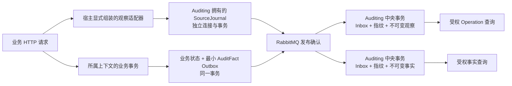

# 自动操作日志

本文件记录 [规格 #60](https://github.com/yongpengW/NexusStackNext/issues/60)、[持久链路 #61](https://github.com/yongpengW/NexusStackNext/issues/61)、[全宿主 HTTP 覆盖 #62](https://github.com/yongpengW/NexusStackNext/issues/62) 与[命令和任务关联 #63](https://github.com/yongpengW/NexusStackNext/issues/63) 的架构、使用语义和验收边界。四个宿主均已显式接入默认 HTTP 采集；命令、业务任务与调度观察已随 [PR #67](https://github.com/yongpengW/NexusStackNext/pull/67) 合并。完整业务事实覆盖与容量治理继续由[后续票据](https://github.com/yongpengW/NexusStackNext/issues/64)验收。决策见 [Auditing ADR-0003](../src/Services/Auditing/docs/adr/0003-source-journal-and-operation-observations.md)。

## 三种审计信息

| 信息 | 能证明什么 | 不能据此推断什么 |
|---|---|---|
| 行审计 `CreatedAt / CreatedBy / UpdatedAt / UpdatedBy` | 当前业务行首次持久化及最近实际修改的元数据 | 每一次请求、历史差异、被拒绝的操作 |
| OperationObservation | 来源观察到某次执行开始或结束，包括拒绝、异常、取消 | HTTP 正常结束就一定发生业务提交 |
| AuditFact / AuditEntry | 来源已提交的最小业务事实 | 没有事实就一定没有请求，或调查端已经收到全部消息 |

例如 Pricing 接受一次重算返回 202，操作观察表达 `accepted`；后台计算是否成功需查任务及其后续事实。一次 HTTP 200 的只读请求可以有完整操作观察，却没有业务变更事实。一次回滚可以有失败操作观察，不能有该次变更的成功 AuditFact。

## 数据归属与交付

中央操作观察按最后接收阶段默认保留30天，开始/结束整组清理，消息去重对照同时到期；
已提交业务事实继续保留。配置、迟到/重投语义及独立迁移见[中央操作观察保留](central-audit-retention.md)。



SourceJournal 是 Auditing 模块部署在来源宿主的一部分，不属于该宿主中的业务上下文。PlatformHost、PricingHost、CostingHost 与 Gateway 显式组合这个模块；业务 Domain / Application 不引用 Auditing 的 Infrastructure，不直接访问其表。来源和中央使用不同 DbContext、schema 与迁移历史。暂时共用物理 PostgreSQL 可以降低开发部署成本，但各自使用独立连接和事务，不能把共库描述成存储故障隔离。网关部署因此需要日志存储配置；journal 的数据仍由 Auditing 拥有。

journal 中的待投递记录本身就是 Outbox。采集适配器一次持久写入稳定身份的观察；没有“先记日志再写消息”的第二次独立写入。RabbitMQ 确认后才标记已投递，进程在确认与标记之间退出时会重发同一消息。已投递只说明 broker 接受，最终是否已接纳以中央调查结果为准。

PostgreSQL journal 追加使用原生有序批次取得消息与阶段事务锁，再以一次有界读取检查两种身份。
两种身份可能命中不同记录，不能把联合结果当成必定只有一行；消息内容重复优先返回原有幂等结果，
阶段冲突在容量检查之前拒绝。容量条件更新与 Outbox 插入仍在同一独立事务里，取消或写入失败不保留额度。
批处理减少往返，保留两把锁、独立事务、执行策略和原取消/故障预算，清理与恢复协议不改。
命令数、语句数与原生批次的实测区别见[来源日志性能验证](identity-query-performance.md#来源日志往返改良139)。

中央消费在一个事务内写 Inbox、内容指纹和 OperationObservation，提交后才确认消费。相同消息身份及内容再次到达应幂等；同身份不同内容拒绝并保留原记录。存储失败要让消息可重投，不能先写 Inbox 再发现记录没有保存。该协议不要求消息恰好只传送一次。

## 操作身份与结果

OperationId 由来源生成，一次操作的 Started 和 Finished 共用它，各阶段有独立且重试不变的消息 ID。Source 由宿主代码确定，不能取客户端自报来源。客户端提供的 trace / correlation 即使被接纳，也只能帮助关联，不能成为身份、去重键或授权依据。

Started 与 Finished 都是不可变证据。调查按操作返回关联视图，不把两条阶段记录误算为两次业务操作；允许 Finished 先到，缺少 Started 时不伪造开始时刻。没有 Finished 时结果为 `unconfirmed`，只能说明尚无完成证据，不能判成超时失败或声称仍在执行。记录同时保留来源发生时间和中央接收时间，分页顺序不代表业务因果顺序。

HTTP 结果按观察定义：

| 结果 | 含义 |
|---|---|
| `completed` | HTTP 管线结束，未落入受理、拒绝或异常分类；不表示数据库提交 |
| `accepted` | HTTP 202，后续工作已受理，未证明完成 |
| `rejected` | HTTP 4xx，当前请求被拒绝；仍可能有刻意提交的业务状态，例如密码错误计数 |
| `failed` | HTTP 5xx、未处理异常或明确的代理传输故障；已发送的 200 等状态仍保留，不披露异常原文 |
| `canceled` | 观察到与客户端取消相关的执行取消；不据此断言业务一定回滚 |
| `unconfirmed` | 中央没有 Finished 证据，是查询结论，不是来源补发的虚构结果 |

来源宿主显式采用 `UseRouting → UseCorrelationId → UseOperationJournal → UseExceptionHandler → UseApiResponseContract → UseAuthentication → UseAuthorization`。网关在认证后另显式接入限流和超时处理，均位于观察适配器内部。路由之后可取模板，返回时可读异常处理转换后的实际状态；不能依赖框架自动插入中间件后恰好得到所需顺序。ASP.NET Core 的排序依据见 [Microsoft 官方文档](https://learn.microsoft.com/en-us/aspnet/core/fundamentals/middleware/?view=aspnetcore-10.0#middleware-added-automatically-by-webapplication)。

YARP 2.3 的路由超时会被转换成 400，见[上游问题 #2662](https://github.com/dotnet/yarp/issues/2662)。网关只在框架超时 token 确实已取消、YARP 报告取消且响应尚未开始时，将取消交回框架超时处理器生成 504。普通下游 400、客户端主动断开均不按此改写。真实 HTTP 验证分别得到 504 / `failed` 与客户端断开 / `canceled`；已开始的流式响应不能改写已发送的状态码。

已发送响应头后，[YARP 会通过 Abort / Reset 结束传输错误](https://github.com/dotnet/yarp/blob/v2.3.0/src/ReverseProxy/Forwarder/HttpForwarder.cs#L824-L886)，这也可能取消 RequestAborted。网关适配器保留明确的目的地错误、路由超时，以及代理主动终止前连接是否已取消的证据，再通过 `MarkOperationFailed` 交给采集器；不把这种内部终止反推为客户端主动取消。真实部分响应测试覆盖后端断流、路由超时、代理 activity timeout 和客户端主动取消：都保留已经发送的 200，前三者为 `failed`，客户端先取消为 `canceled`。接收方不再要求 `failed` 必须搭配 5xx，因为响应头发出后不能据此推断传输已完成。

HTTP Started 位于认证前，Actor 为空；Finished 仅使用已认证声明中的用户身份，认证失败或没有用户时为空。后台执行的 Actor 与原 Initiator 独立表达，具体语义见下节。

新采集的 HTTP 两个阶段均保存自身 OperationId / Source 为根操作字段，使根操作调查同时返回原请求和后续执行。
网关与业务宿主各自建立本地根，跨 HTTP 转发仍通过追踪和 correlation 关联；不把外来请求字段当作可信操作身份。
旧 HTTP 记录没有这些字段时保持未知，重投不补写，也不在查询时推造历史关联。

## 命令与业务任务

`ISender` 的独立命令默认产生一次 `command` 操作，覆盖校验、事务入口与返回结果；查询不产生命令操作。已有 HTTP 或外层命令作用域时，内层命令沿用它，不重复记录。显式排除的 HTTP 入口也排除其内部命令；父作用域结束后，异步子流程不能再复用已结束的操作。

命令成功默认表示本次命令入口已完成。声明 `BackgroundWorkAcceptance` 的受理与人工重试命令只记录 `accepted`；业务拒绝为 `rejected`，异常为 `failed`，与本次取消令牌有关的取消为 `canceled`。不序列化命令参数、返回值或错误正文。后台领取、完成和失败汇报声明 `CommandObservationSuppression` 并附原因：领取是内部协调，计算入口已有独立任务观察，失败汇报只负责持久化业务重试状态。这种声明只排除通用命令观察，不关闭已有 HTTP 或显式任务观察。

任务受理与人工重试命令通过 `ITaskOperationCommand` 显式声明目标 TaskId；独立命令观察只读取该强类型标识，不扫描命令属性或载荷。TaskEpoch 留空，因为这次管理操作尚不代表某个计算租约；目标标识也不证明任务存在或操作成功。HTTP 内部命令仍沿用 HTTP 操作，重试 HTTP 入口保留原有的任务客体声明。人工重试有自己的操作者和操作标识，通过 TaskId 关联原任务；后台尝试继续关联最初任务受理来源，不改写原发起人。

Costing / Pricing 在任务受理事务内保存可空的 `ExecutionOrigin`，包含直接触发操作、根操作、原发起人和安全关联。请求重投保持最初来源，不能用重投人的身份覆盖它。实际计算入口以系统 Actor 执行，原发起人只在 `InitiatorId` 中表达；日志关联不授予业务权限。

每次实际调用计算入口产生自己的 OperationId；同次调用的两个阶段共用它，持久化后重投保持阶段消息身份。`Source + TaskId + TaskEpoch` 关联业务任务及租约代次；同代次若被重复调用，会有不同的操作记录，不把它们合并成一次真实执行。只有实际提交返回成功才记录 `completed`；旧输入被取代为 `superseded`，丢失执行权为 `lease_lost`。执行取消不等于业务任务进入取消终态，失败观察也不替代任务自己的失败和重试协议。

观察覆盖读取输入时的异常和取消。输入读取完成后才知道持久化来源；未读到来源时不猜测 Initiator 或父操作，仍用 TaskId / TaskEpoch 保存当前调用的证据。若进程在来源读取完成且 Started 持久化之前退出，可能没有该次调用的操作观察，不能补造记录；业务租约历史仍由所属上下文保存。已经保存 Started、未保存 Finished 的调用在中央保持 `unconfirmed`。

Costing 的 `CostCalculatedV1` 随业务 Outbox 保存产出结果的执行来源；Pricing 校验该可选字段，与 Inbox、业务更新和新任务一起接纳。新字段参与内容指纹，同身份重投不能更换或删除关联；不含该字段的旧消息保持原指纹。旧任务可以没有来源，不能追填成当前调用人。业务任务和中央观察使用增量迁移，来源 journal 的载荷表不需要额外迁移。

Pricing 对每次有效成本消息消费建立独立 `message` 操作，动作 `pricing.cost.accept`，客体为固定事件名和消息 GUID。
新任务保存本次受理操作为直接来源，上游 Costing 操作为父级，根操作、原发起人和关联标识保持不变。
消息指纹仍使用原始载荷；重复投递不改写首次来源，旧任务保留已存关系。不同投递尝试各有操作标识，
结论区分 accepted / duplicate / skipped / rejected / failed / canceled，不把消费确认当成价格计算完成。
独立 journal 保留失败或取消观察，业务状态和新事实一起回滚。系统执行标记同时约束行审计与事实 Actor，
调用链中的用户只能保留为原发起关系，不会被误写成后台执行者。该标记不参与授权。

Scheduling 定义计划时，将当前来源与计划同一次保存；规则变更、启停及调度推进不改写原始来源。领域层保持独立，该元数据归应用与存储边界。来源随 Occurrence 和 `ScheduleTriggeredV1` 持久交付给 Costing，在 Costing 接受任务时保存；消息校验与指纹同时包含关联，旧消息没有该字段时保留原指纹。计划和发生的新增列是可空 jsonb，采用独立增量迁移。

Costing 消费计划消息也有独立 `message` 操作（`costing.schedule.accept`），成功受理成为新任务直接来源，
消息中的调度操作成为其父级。稳定业务拒绝回执成功提交后仍 ACK，但结果记为 rejected；重复消息为 duplicate。
无来源的旧消息不从 CreatedBy 补造发起关系。提交失败/取消保留失败观察，进程终止只有 Started 时保持 unconfirmed；
重投成功产生新操作。区间与日历计划的完整旅程需验证：定义请求 → 调度 → Costing 消费 → 成本计算 → Pricing 消费，
相同成本结果在 Pricing 记为 skipped，不虚构新计算或新业务版本。

每个到期计划的裁决独立产生 `schedule` 操作；空扫描不产生操作。`SchedulePlanId + ScheduleExpectedVersion + ScheduleDecisionId` 关联读取的计划版本与本次拟登记的决定，不借用业务任务的 TaskId / TaskEpoch。成功登记触发为 `accepted`，按漏跑策略登记跳过为 `skipped`，版本竞争失败为 `rejected`，计算或存储异常为 `failed`，执行取消为 `canceled`。失败和拒绝记录中的 DecisionId 不证明数据库中存在对应决定。系统 Actor 保持为空，原发起人仍取已保存的来源；发生消息的直接父级改为本次调度操作，根操作保持不变。三个调度关联字段参与中央内容指纹，并以可空列增量迁移。

文件后台清理逐文件产生 `recovery` 操作，动作 `files.deletion.recover`，客体为 `stored-file` 及其内部标识。
每次尝试独立配对 Started / Finished，未确认清除为 `deferred`，已确认清除为 `completed`，异常与取消为
`failed` / `canceled`；这些结果均可用 `outcome` 过滤。恢复既没有任务租约，也没有计划决定，中央接收时拒绝混入这些字段。
Files 首次删除事务保存来源；重复请求、延期、重启和并发失败都不能替换它。恢复操作的 Actor 为空，
Initiator 仅来自已保存来源；旧记录没有来源时本次执行自成根，不根据文件 Owner 猜测身份。
删除 HTTP 返回 202、后台恢复完成、字节移除事实是三个不同的证据。

未保存操作来源的计划仍有明确的 `DelegatedBy`，因此可以保留已知委托人为 Initiator，但不能虚构此前的根操作或父操作；此时日志关联从本次调度开始。提交中取消会尝试用独立 journal 记录 `canceled`，不能把它解释成计划已取消或下游任务已取消。

当前切片已覆盖命令嵌套与并发隔离、校验拒绝、异常与取消、日志故障隔离、受理来源跨重启保留、计划来源进入 Costing、真实数据库回滚、人工重试、输入读取取消和中央关联字段持久化。调度的触发、漏跑跳过、版本竞争和回滚后重试也有公共入口验证。

真实 HTTP / RabbitMQ / PostgreSQL 旅程已验证：请求经网关受理后关闭来源进程，重启执行 Costing → Pricing，受权调查查询可关联两个 HTTP 操作、一次 Pricing 消息消费与两次后台计算；跨消息丢失 Initiator 的可编译变异会使该旅程失败。另一条旅程在 Pricing 提交被阻塞时强杀进程，证明业务事务回滚、独立 journal 保留 Started，并在重启交付后显示 `unconfirmed`；新租约执行成功后，原操作仍保持未确认。旧租约失权与旧成本输入被替换分别记录 `lease_lost` / `superseded`，不会伪造结果或发布旧成本结果。

上述场景不能替代完整回归、模板、Linux CI 与双轴评审；各项合并门禁的实际结论记录在本票及 PR 中。后续任务管理票据的取消和续租入口必须按同一语义扩展覆盖。

## 默认覆盖与安全边界

四个宿主的普通 HTTP 入口默认进入观察，包括 `/api` 以外的业务路由、授权拒绝和未匹配请求。`/health`、`/openapi`、`/swagger`（含 UI 静态资源）、`/gateway/openapi` 与既有 `/hubs` 协议路径是保留排除范围。当前没有其它静态文件宿主；以后增加资源服务必须显式确定其管线或排除元数据。Auditing 的两个调查 GET 端点显式排除；网关只为对应的专用 GET 代理路由附加同样声明，通配代理路由和未来管理写入继续默认采集。

`OperationEndpointInventoryTests` 从四个真实宿主的 EndpointDataSource 枚举路由，非空断言后逐个请求业务接口并检查待交付观察；健康、文档、调查查询和 Swagger 静态资源验证无新增记录。实时协议只做范围识别，不在本票新增或验收 SignalR 功能。新加的普通端点没有日志声明也会采集。

默认只允许固定安全字段：来源、操作和消息标识、观察阶段、发生时间、受信身份、HTTP 方法、已匹配的路由模板、响应状态、耗时、稳定结果和追踪关联。记录路由模板，不用含真实标识或秘密的原始路径替代未匹配模板。

操作观察不记录原始 body、query 值、Authorization、Cookie、口令、令牌、文件内容、任意请求对象或异常原文。框架诊断日志属于另一条日志管线，本模块不承诺自动清洗框架或业务自行输出的文本。业务描述、Action、Subject 须通过显式元数据边界，并受格式和长度限制；不能反射序列化整个参数对象。

### 声明固定说明与安全客体

业务 Endpoints 只引用 `Auditing.Contracts`，无需自行发布消息：

```csharp
endpoint.WithMetadata(new OperationDescription("costing.task.retry", "重试成本计算",
    new OperationSubjectRoute("CostCalculation", "taskId", OperationSubjectIdKind.Uuid)));
```

Action 最多 200 字符、Description 最多 256 字符，均为固定文本；没有声明时 Action 使用 `http.get` 等固定方法分类，与路由模板共同识别入口。非常规方法使用有界分类，未知方法为 `OTHER`，不保存任意方法原文。路由模板超过 500 字符或不满足安全格式时为空，绝不退回原始路径。

六个来源的容量策略 PUT 声明固定动作 `<context>.fact-capacity-policy.adjust`（context 为 platform、identity、files、scheduling、costing、pricing），描述为“调整所属事实容量策略”。声明只引用 Auditing.Contracts，不自行写日志。平台宿主中的 Identity / Files / Scheduling 观察来源仍为 platform，动作表示实际拥有策略的上下文；不把模块归属伪称部署来源。策略重放和拒绝各有自己的操作，已提交治理事实只关联首次真实变更的操作；观察 completed 不能代替数值变更事实。请求中的 RequestId、任意理由、正文及敏感头不作为动态说明或客体采集。四平台 Memory / PostgreSQL 及两业务 PostgreSQL 的资格与整票交付见 [#101](https://github.com/yongpengW/NexusStackNext/issues/101)。

Subject 仅从指定路由参数读取非空 Guid 或正 Int64，统一为字符串；`9007199254740993` 不会经 JavaScript number 丢精度。非法值整体省略 Subject，不丢弃该次请求；body 中的 ItemId 不自动采集。Subject 表示请求指向的客体，不证明它存在或已经成功授权。成本和定价的重试接口给出了两个真实用例。

低价值轮询可声明 `new OperationLogSuppression("明确的静态原因")`，优先于描述；不能因为旧 PoS 某接口曾标记 NoLogging 就批量复制排除范围。

网关转发的 `metadata.executionRole` 为 `proxy`，其 Action 为 `gateway.forward`；下游处理为 `endpoint`，两条记录有不同的 OperationId。调查应按角色区分转发结果和业务处理，再用 TraceId 关联，不能把两条 `completed` 算成两次业务提交。SpanId / ParentSpanId 保存实际追踪关系；中间可能存在代理客户端 span，不能推断下游的直接父级一定是网关服务端 span。

`X-Correlation-Id` 只接受 1–64 位 ASCII 字母、数字、点、下划线和短横线；缺失、超长、多值、控制字符及其它字符均重新生成，不截断。四个宿主在采集前规范化，并随请求转发、随响应返回。它允许由客户端选择，因此只用于关联，不能用来认证用户或判断消息重复。

所有环境都不提供公共 HTTP 写入观察的接口，root 也不能通过 HTTP 自报 Actor 或 Source。消息摄取的信任边界仍是 broker 发布身份、ACL 和受信契约；固定 Source 字符串不是数字签名，持有合法发布权限的进程必须受到对应权限约束。

## 故障策略

普通操作观察采用 fail-open：采集失败不改写业务已经形成的响应，不把成功提交伪装成业务失败，也不声称已可靠采集。每次 journal 写入使用独立的有界超时，不直接继承客户端取消；这允许在请求取消后尝试记录观察，同时避免无限等待日志存储。

| 故障位置 | 普通观察的行为与限制 |
|---|---|
| 来源 journal 写入失败 | 业务继续；`/health/logging`、失败计数和安全诊断暴露降级，该阶段证据可能缺失 |
| broker 不可用 | 已持久化 journal 保留；重试预算内恢复后继续，预算耗尽则停止自动投递并报告死信，显式恢复管理由 #64 补齐；中央暂时查不到不等于从未发生 |
| 中央 Auditing 不可用 | 消费不确认未提交记录，恢复后重投；已保存的来源证据不随业务事务回滚 |
| 开始后进程退出 | 不能保证产生 Finished；只有 Started 的中央操作显示 `unconfirmed` |
| 同身份异内容 | 拒绝冲突消息，不能修改已接纳证据或当作正常重复忽略 |

四个宿主将业务就绪和异步日志诊断分开：

| 健康入口 | 检查范围与用途 |
|---|---|
| `/health/ready` | 只检查当前处理业务所需的依赖，排除来源 journal、中央 Auditing 数据库和 Auditing 消息依赖；供网关决定业务流量是否可以转发 |
| `/health/logging` | 只检查宿主已组装的异步日志依赖；来源 journal 运行故障或历史缺失报告 `Degraded`、HTTP 200，中央 Auditing 数据库或审计 broker 故障报告 `Unhealthy`、HTTP 503 |
| `/health/live` | 进程存活，不检查外部依赖 |

三类日志检查统一标记 `AuditingDiagnostics.HealthTag`（`auditing-diagnostics`），由宿主显式筛选到 `/health/logging`。不能仅把日志检查的结果从 `Unhealthy` 改成 `Degraded` 后继续放在 `/health/ready`：日志探测本身也可能阻塞并超过网关的探测超时，仍会导致业务目的地被摘除。运维必须单独监控日志入口；业务就绪正常不表示操作观察完整、消息已经交付或调查可用。未组装 broker 也不等于交付链路已经就绪。

这种运行期隔离不放宽启动检查：未完成迁移、数据库不可用或配置错误仍快速失败。同一进程中，后续成功不会清除此前的采集失败计数，存储恢复后日志诊断仍报告降级。计数在进程重启后归零；`NexusStackNext.OperationJournal` Meter 的 `operation_journal.write_failures` 可由监控收集，跨重启保留告警与完整缺口治理由 #64 补齐。若业务与日志共用的物理 PostgreSQL 整体故障，业务自己的依赖检查仍会使业务就绪失败，不能据此宣称物理故障已经隔离。

采集故障的诊断不能重新进入自动观察链路，也不能输出原始异常及连接配置。fail-open 只描述普通采集的业务响应策略，并不保证 journal 一直可写、存储无限或跨机可用。

关键 AuditFact 不走普通观察的降级策略：它必须由来源上下文与业务状态在同一事务写入。关键事实保存失败时该事务不提交，回滚和空操作不制造成功变更事实。现有[已提交事实审计](committed-auditing.md)已完成全局设置链路，并接入 Identity 的账户、权限、菜单和令牌等持久变化；完整事实覆盖由 #64 逐项验收。

## 显式配置与初始化

来源配置与中央 Auditing 配置分别管理，不能隐式拿业务 DbContext 或请求事务保存观察。#61 的配置接口为：

| 配置 | 约束 |
|---|---|
| `ConnectionStrings:OperationJournal` | PostgreSQL 模式必填，来源 journal 的独立连接配置；不回显其值 |
| `OperationJournal:Storage:Provider` | 默认 `Postgres`；显式 `Memory` 仅限 Development / Testing |
| `OperationJournal:WriteTimeout` | 每个阶段写入预算，默认 `00:00:02`，允许 50 毫秒至 5 秒 |
| `OperationJournal:Capacity:MaxRecords` | 来源观察记录数上限，默认 100000，允许 1–10000000；恢复凭据使用独立额度 |
| `OperationJournal:Capacity:MaxRecoveryRecords` | 独立恢复凭据额度，默认 10000，允许 1–1000000；不占普通观察额度 |
| `OperationJournal:Capacity:MaxPayloadBytes` | 所有保留载荷的 UTF-8 字节上限，默认 256 MiB，允许 1 字节至 64 GiB |
| `OperationJournal:Capacity:MaxRecordPayloadBytes` | 单条载荷 UTF-8 字节上限，默认 16 KiB，允许 1 字节至 64 KiB |
| `OperationJournal:Cleanup:Enabled` | 默认 `true`，由来源宿主启动清理；关闭后仍保留容量限制 |
| `OperationJournal:Cleanup:DeliveredRetention` | 首次发布确认后保留多久，默认 `1.00:00:00`，允许 1 小时至 30 天 |
| `OperationJournal:Cleanup:RecoveryRetention` | 恢复凭据保留期，默认 `30.00:00:00`，允许 1 小时至 365 天；创建时固定到期时间 |
| `OperationJournal:Cleanup:BatchSize` | 每类清理批次最大条数，默认 500，允许 1–1000 |
| `OperationJournal:Cleanup:Interval` | 两轮清理间隔，默认 `00:01:00`，允许 1 秒至 1 小时 |
| `OperationJournal:Cleanup:Timeout` | 每轮两类清理共享的维护预算，默认 `00:00:05`，允许 50 毫秒至 30 秒 |
| `OperationJournal:Delivery` | 来源发布的 `OutboxDeliveryOptions` 配置；broker 确认与中央接纳仍是不同状态 |

上述配置接口由四个宿主共同使用。Memory 用于开发演示，重启会丢失观察，不能用于声称持久性或恢复能力。来源 journal 与中央观察表各自先迁移，再启动来源宿主和消费者；普通启动不代替数据库迁移。新的表和索引采用增量迁移，不重写已经合并的初始基线。Aspire 显式注入各来源 journal 连接与完整 RabbitMQ 配置；独立网关启动也必须提供 journal 配置。

普通观察额度包含待投递、死信和已交付尚未清理记录；共用同一 journal 的宿主共享额度并须使用一致配置。
满额或单条过大时拒绝新观察，保留已有记录与身份幂等，普通采集报告缺口并保持业务响应。
日志健康检查报告 `retainedRecords`、`retainedPayloadBytes`、`maxRecords`、`maxPayloadBytes`、`capacityReached`；
满额即降级，不必等下一条观察丢失。字节值只统计载荷，不是磁盘配额，也不代表生产容量已验证。
额度表的增量迁移回填旧记录；升级先停用该 journal 的所有旧来源写入者，再迁移并统一启用新版本，不能混跑旧写入逻辑。
依据及待完成的清理/恢复约束见 [来源容量决定](../src/Services/Auditing/docs/adr/0005-source-journal-capacity-is-bounded.md)。

来源宿主启动后自动清理一批达到保留期的已交付副本，随后按间隔继续；清理与额度释放同事务。
不会删待投递、死信或保留期内记录，也不会删中央观察、指纹和 Inbox。来源消息清理后重投仍由中央去重，
不能把过期的消息 ID 用于新内容。新增部分索引也必须先显式迁移。
`cleanupFailures` 是进程内累计维护失败数，`cleanupDegraded` 表示最近一轮失败；下一轮成功可恢复维护状态，
但不清除 `failedWrites` 代表的历史采集缺口。停机取消正常终止，运行期超时报维护故障并在下一轮重试。
日志保留时间、额度和清理吞吐应一起配置；默认值不代表任何具体生产流量的容量验收。

同一后台循环还清理已达到固定 `RetainUntil` 的恢复凭据；它与源消息清理分别提交事务。
修改恢复保留配置不影响已有凭据的期限。到期但未清理的凭据仍占额度，也仍支持原请求重放；
清理提交后才释放额度，并结束该请求的历史对照。清理不改变原消息的状态或恢复版本。
`retainedRecoveryRecords`、`maxRecoveryRecords`、`recoveryCapacityReached` 单独报告控制额度，
达到上限时日志健康状态为 Degraded，清理释放额度后可恢复。早期无固定期限的开发记录由迁移按恢复时刻加 30 天回填。

来源维护端口已支持不含载荷的死信分页和条件重试：恢复时回传读取到的停止时间及恢复版本，
成功后沿用原消息身份与内容，只重新开启投递预算，并在同次提交保存恢复凭据。调用方提供稳定恢复请求 ID，
同身份同请求重放原凭据，同身份不同内容或操作者冲突；新的过期操作也冲突。查询可按来源过滤，
每页最多 100 条。公共 Outbox 已用同一个恢复版本隔离旧在途批次的失败，真实成功确认仍优先。
独立维护命令已开放查询与条件恢复；公共恢复端口要求请求身份与可信适配器提供的执行标签。
维护查询不是中央调查记录，来源已清理后查不到消息也不证明中央没有保存。

四个宿主提供独立维护命令：

```text
dotnet <来源宿主.dll> operation-journal show <message-id>
dotnet <来源宿主.dll> operation-journal retry <request-id> <message-id> <stopped-at> <retry-revision> <reason>
dotnet <来源宿主.dll> operation-journal receipt <request-id>
```

先从 show 读取停止时间与恢复版本，再决定恢复；时间使用含时区的 ISO 8601，版本必须为非负整数，
reason 只允许 `dependency-restored` 或 `manual-retry`。调用方为一次恢复生成请求 UUID，响应丢失时原样复用，
不得为了重试而换请求身份。系统账户和主机标签由命令读取，不能通过参数冒充业务 Actor。
retry 与 receipt 返回原恢复凭据；当前交付状态仍用 show 查询。凭据不存在不等于从未恢复，也可能已经到期清理。

命令在 Web、配置中心与业务模块启动前运行，通过环境中的 `ConnectionStrings__OperationJournal`
查询 PostgreSQL 来源存储；不会使用开发 Memory 配置创建空存储，也不会自动迁移。
成功返回安全状态 JSON（退出码 0）；参数无效返回固定错误码与退出码 2，记录不存在为 3，
状态冲突或恢复额度不足也为 3，配置或存储故障为 1。输出不包含载荷、原始异常或连接配置。维护权限由本机执行权限和数据库凭据控制，
不能把 Source 字段当成授权。命令执行预算为 10 秒。

真实子进程与临时 PostgreSQL 验证四个宿主的早期入口、安全状态读取、配置故障、未迁移和不存在的区别；
恢复命令还验证系统执行标签、同请求重放、过期拒绝及配置的恢复额度与期限。
命令从环境读取 `OperationJournal__Capacity__*` 与 `OperationJournal__Cleanup__*`，沿用宿主的默认值、绑定及校验。
执行维护时必须注入该来源部署相同的策略；若策略由配置中心管理，先将相应配置注入受保护的进程环境，
命令不会自行连接配置中心或猜测当前策略。非法配置在任何修改之前安全失败。
[状态与恢复凭据原子提交](../src/Services/Auditing/docs/adr/0006-source-recovery-is-recorded-atomically.md)
已通过双存储重放、并发、取消和 PostgreSQL 双向写入故障验证；固定期限、到期清理与控制容量诊断也已实现。
普通操作日志的尽力写入不能替代这项留痕保证。源消息清理后恢复凭据仍可查询，凭据本身不表示当前消息仍 Pending。

来源固定使用 `operation_journal` schema，迁移历史也归它所有。四个宿主提供独立 `migrate-operation-journal` 命令，只迁移来源 journal，不启动业务 HTTP 或 broker。连接配置通过进程环境的 `ConnectionStrings__OperationJournal` 提供，值不能放入命令行或会话：

```powershell
dotnet NexusStackNext.PlatformHost.dll migrate-operation-journal
dotnet NexusStackNext.PricingHost.dll migrate-operation-journal
dotnet NexusStackNext.CostingHost.dll migrate-operation-journal
dotnet NexusStackNext.Gateway.dll migrate-operation-journal
```

在来源宿主对应的部署目录运行适用的一条命令；共用同一 journal 数据库时只需初始化一次。中央观察表属于 `auditing` schema，继续使用 PlatformHost 的 `migrate-auditing` 入口。固定 Source 分别为 `platform`、`pricing`、`costing`、`gateway`，不能在请求中覆盖。

### 升级与旧消息

`OperationObservedV1` 增加可选 Metadata，所有新增可选字段为空时不输出 JSON；旧 journal 原文与中央旧指纹保持不变。中央 `OperationMetadata` 迁移只增加可空列。旧二进制冻结的消息及指纹测试证明积压重放不产生重复记录，且不能通过重投给旧阶段补写元数据。

升级顺序：停止旧中央消费者，应用中央迁移并启动新消费者，再启用带 Metadata 的新来源。旧消费者会忽略新字段，因此本轮不支持新来源与旧中央消费者混跑时完整保存元数据；不要把可读旧积压误称为任意版本滚动兼容。普通宿主启动始终不自动迁移。

## 调查入口与验收

首票的入口是 `GET /api/auditing/operations?page=1&limit=20`，对应权限资源 `/api/auditing/operations` + `GET`；页码范围 1–1000，每页最多 100 条。返回操作级 summary，`startedAt` / `finishedAt` 允许为空，`outcome` 使用前述结果；阶段缺失必须保留，不能制造时间或完成状态。

查询默认最近七天，`from` / `to` 均含边界、按 UTC 比较；单边界补齐七天，每次最多三十一天。
时间窗口针对最后已有的阶段发生时刻：先选择 Finished（缺少时才用 Started），再应用窗口及其他条件；
不能因为 Finished 被时间条件排除，就把 Started 重新显示成 `unconfirmed`。可以指定历史窗口，默认窗口不删除历史。

精确过滤包括 `source`、`operationId`、`outcome`、`actorId`、`traceId`、`action`、`subjectType`、`subjectId`、
`correlationId`、`initiatorId`、`rootOperationId` / `rootSource`、`parentOperationId` / `parentSource`、`taskId` / `taskEpoch`。
轮次必须为正数，并同时指定任务标识。原发起人和当前 Actor 是两个独立条件；查询总数只表示条件内的操作数量，
不表示业务提交次数。通过操作来源/标识关联[已提交事实](committed-auditing.md)，两类记录仍各自陈述其证据。

受权调查查询属于 #61，而不是等容量治理时才补。查询只能读 Auditing 自己的数据，必须检查当前会话和显式读取权限，分页大小、偏移和已提供的过滤值必须有上限与验证；不能提供匿名查询、任意 SQL/排序字段或跨上下文 JOIN。查询响应按 Operation 组织，明确阶段是否缺失；只获得调查权限不会自动获得投递恢复或其它管理权限。

#61 已实现两个宿主样板。目标测试覆盖以下行为，核心交付、查询及故障隔离旅程已在真实 HTTP、RabbitMQ、临时 PostgreSQL 和进程重启中验证：

- 两个来源宿主都默认采集业务请求，普通成功、202 受理和授权拒绝具有正确且不泄密的观察；排除路径不被误采集。
- 业务回滚后观察仍可调查，关键事实不虚构提交，来源存储故障按普通采集策略降级并可观察。
- 来源 journal 的慢故障、中央 Auditing 数据库及审计 broker 故障由 `/health/logging` 独立报告；业务依赖可用时，真实网关仍能在主动探测后转发业务，`/health/ready` 不等待日志探测。
- broker 尚未接入及来源重启后，已经接受的 journal 能恢复交付；中央存储故障和重复投递不产生半成品。
- 相同身份同内容幂等、异内容拒绝、Finished 先于 Started 到达被接受；无 Finished 时查询保持 `unconfirmed`。
- 调查接口的身份、权限、会话失效、分页与过滤边界确实生效，不存在公开 HTTP 摄取入口。
- 独立迁移、Production 禁用 Memory、模板装配与架构约束。

#62 在上述基线上追加验证：四宿主真实端点清单；代理与业务的角色、追踪和安全关联；401 / 403 / 400 / 429 / 500 / 502 / 504 / 202 与客户端取消；声明客体及排除优先级；旧消息、旧指纹和增量迁移兼容。Gateway 与 Costing 的真实进程在未接入 broker 时保存观察，退出重启后恢复投递；两个来源的 journal 故障均不阻断成本提交或让业务就绪失败，恢复后仍保留历史缺口的降级标记。

每个 PR 必须完成全量串行回归、格式检查、Linux CI 与 Standards / Spec 双轴评审；实际门禁结果记录在对应票据和 PR 中，目标测试不能替代整套门禁。

## 后续能力边界

[票据 #64](https://github.com/yongpengW/NexusStackNext/issues/64) 负责完整来源、动作、客体、身份、时间、操作/任务关联和结果检索，逐上下文关键事实覆盖，以及来源容量、积压、超时、死信恢复、已交付清理和两类记录各自的保留策略。#61 的持久链路不能被宣称为已经具备完整容量与保留治理；持续故障的无界增长风险必须由该票实际解决。

SignalR 与实时消息中心等待最后共同设计。多机高可用、灾备和容量演练也不在本轮实施，用户决定后再安排；本轮文档与测试不构成多机高可用承诺。
