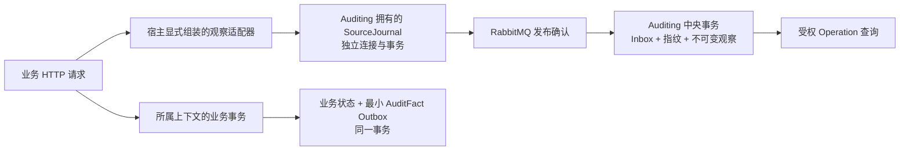

# 自动操作日志

本文件记录 [规格 #60](https://github.com/yongpengW/NexusStackNext/issues/60) 与[首个切片 #61](https://github.com/yongpengW/NexusStackNext/issues/61) 的架构、使用语义和验收边界。PlatformHost 与 PricingHost 的默认采集、持久交付和受权查询样板已经实现，核心链路已通过真实 HTTP、PostgreSQL、RabbitMQ 与进程重启的目标验收。该范围不代表全宿主覆盖，也不替代全量回归和 CI 的门禁结论。决策见 [Auditing ADR-0003](../src/Services/Auditing/docs/adr/0003-source-journal-and-operation-observations.md)。

## 三种审计信息

| 信息 | 能证明什么 | 不能据此推断什么 |
|---|---|---|
| 行审计 `CreatedAt / CreatedBy / UpdatedAt / UpdatedBy` | 当前业务行首次持久化及最近实际修改的元数据 | 每一次请求、历史差异、被拒绝的操作 |
| OperationObservation | 来源观察到某次执行开始或结束，包括拒绝、异常、取消 | HTTP 正常结束就一定发生业务提交 |
| AuditFact / AuditEntry | 来源已提交的最小业务事实 | 没有事实就一定没有请求，或调查端已经收到全部消息 |

例如 Pricing 接受一次重算返回 202，操作观察表达 `accepted`；后台计算是否成功需查任务及其后续事实。一次 HTTP 200 的只读请求可以有完整操作观察，却没有业务变更事实。一次回滚可以有失败操作观察，不能有该次变更的成功 AuditFact。

## 数据归属与交付



SourceJournal 是 Auditing 模块部署在来源宿主的一部分，不属于该宿主中的业务上下文。PlatformHost 和 PricingHost 都显式组合这个模块；业务 Domain / Application 不引用 Auditing 的 Infrastructure，不直接访问其表。来源和中央使用不同 DbContext、schema 与迁移历史。暂时共用物理 PostgreSQL 可以降低开发部署成本，但各自使用独立连接和事务，不能把共库描述成存储故障隔离。

journal 中的待投递记录本身就是 Outbox。采集适配器一次持久写入稳定身份的观察；没有“先记日志再写消息”的第二次独立写入。RabbitMQ 确认后才标记已投递，进程在确认与标记之间退出时会重发同一消息。已投递只说明 broker 接受，最终是否已接纳以中央调查结果为准。

中央消费在一个事务内写 Inbox、内容指纹和 OperationObservation，提交后才确认消费。相同消息身份及内容再次到达应幂等；同身份不同内容拒绝并保留原记录。存储失败要让消息可重投，不能先写 Inbox 再发现记录没有保存。该协议不要求消息恰好只传送一次。

## 操作身份与结果

OperationId 由来源生成，一次操作的 Started 和 Finished 共用它，各阶段有独立且重试不变的消息 ID。Source 由宿主代码确定，不能取客户端自报来源。客户端提供的 trace / correlation 即使被接纳，也只能帮助关联，不能成为身份、去重键或授权依据。

Started 与 Finished 都是不可变证据。调查按操作返回关联视图，不把两条阶段记录误算为两次业务操作；允许 Finished 先到，缺少 Started 时不伪造开始时刻。没有 Finished 时结果为 `unconfirmed`，只能说明尚无完成证据，不能判成超时失败或声称仍在执行。记录同时保留来源发生时间和中央接收时间，分页顺序不代表业务因果顺序。

HTTP 结果按观察定义：

| 结果 | 含义 |
|---|---|
| `completed` | HTTP 管线结束，未落入受理、拒绝或异常分类；不表示数据库提交 |
| `accepted` | HTTP 202，后续工作已受理，未证明完成 |
| `rejected` | HTTP 4xx，当前请求被拒绝；仍可能有刻意提交的业务状态，例如密码错误计数 |
| `failed` | HTTP 5xx 或未被下游处理的异常；不披露异常原文 |
| `canceled` | 观察到与客户端取消相关的执行取消；不据此断言业务一定回滚 |
| `unconfirmed` | 中央没有 Finished 证据，是查询结论，不是来源补发的虚构结果 |

两个来源宿主显式采用 `UseRouting → UseOperationJournal → UseExceptionHandler → UseApiResponseContract → UseAuthentication → UseAuthorization`。观察适配器包住后续处理，路由之后可取模板，返回时可读异常处理转换后的实际状态；不能依赖框架自动插入中间件后恰好得到所需顺序。ASP.NET Core 的自动装配与显式排序依据见 [Microsoft 官方文档](https://learn.microsoft.com/en-us/aspnet/core/fundamentals/middleware/?view=aspnetcore-10.0#middleware-added-automatically-by-webapplication)。

本票 Started 位于认证前，Actor 为空；Finished 仅使用已认证声明中的用户身份，认证失败或没有用户时为空。后台执行的 Actor 与原 Initiator 必须独立表达；后台任务采集与关联是后续票据，当前 HTTP 样板不承诺已经覆盖它们。

## 默认覆盖与安全边界

#61 的实际接入范围是 **PlatformHost 与 PricingHost**。普通业务 `/api` 请求默认进入观察，包括授权拒绝路径；健康、文档、静态资源以及 Auditing 自身的调查入口不采集，避免调查操作和故障诊断不断产生新的采集工作。不能为保留这两个宿主样板而把其它服务标为已覆盖；Costing、Gateway 和后台执行留到后续切片。

默认只允许固定安全字段：来源、操作和消息标识、观察阶段、发生时间、受信身份、HTTP 方法、已匹配的路由模板、响应状态、耗时、稳定结果和追踪关联。记录路由模板，不用含真实标识或秘密的原始路径替代未匹配模板。

不记录原始 body、query 值、Authorization、Cookie、口令、令牌、文件内容、任意请求对象或异常原文。业务描述、Action、Subject 与扩展字段须通过显式元数据边界，并受白名单和长度限制；不能因为方便而反射序列化整个参数对象。第一票的固定元数据不能被宣称为可自由保存业务载荷的通用日志接口。

所有环境都不提供公共 HTTP 写入观察的接口，root 也不能通过 HTTP 自报 Actor 或 Source。消息摄取的信任边界仍是 broker 发布身份、ACL 和受信契约；固定 Source 字符串不是数字签名，持有合法发布权限的进程必须受到对应权限约束。

## 故障策略

普通操作观察采用 fail-open：采集失败不改写业务已经形成的响应，不把成功提交伪装成业务失败，也不声称已可靠采集。每次 journal 写入使用独立的有界超时，不直接继承客户端取消；这允许在请求取消后尝试记录观察，同时避免无限等待日志存储。

| 故障位置 | 普通观察的行为与限制 |
|---|---|
| 来源 journal 写入失败 | 业务继续；`/health/logging`、失败计数和安全诊断暴露降级，该阶段证据可能缺失 |
| broker 不可用 | 已持久化 journal 保留；重试预算内恢复后继续，预算耗尽则停止自动投递并报告死信，显式恢复管理由 #64 补齐；中央暂时查不到不等于从未发生 |
| 中央 Auditing 不可用 | 消费不确认未提交记录，恢复后重投；已保存的来源证据不随业务事务回滚 |
| 开始后进程退出 | 不能保证产生 Finished；只有 Started 的中央操作显示 `unconfirmed` |
| 同身份异内容 | 拒绝冲突消息，不能修改已接纳证据或当作正常重复忽略 |

PlatformHost 与 PricingHost 将业务就绪和异步日志诊断分开：

| 健康入口 | 检查范围与用途 |
|---|---|
| `/health/ready` | 只检查当前处理业务所需的依赖，排除来源 journal、中央 Auditing 数据库和 Auditing 消息依赖；供网关决定业务流量是否可以转发 |
| `/health/logging` | 只检查宿主已组装的异步日志依赖；来源 journal 运行故障或历史缺失报告 `Degraded`、HTTP 200，中央 Auditing 数据库或审计 broker 故障报告 `Unhealthy`、HTTP 503 |
| `/health/live` | 进程存活，不检查外部依赖 |

三类日志检查统一标记 `AuditingDiagnostics.HealthTag`（`auditing-diagnostics`），由宿主显式筛选到 `/health/logging`。不能仅把日志检查的结果从 `Unhealthy` 改成 `Degraded` 后继续放在 `/health/ready`：日志探测本身也可能阻塞并超过网关的探测超时，仍会导致业务目的地被摘除。运维必须单独监控日志入口；业务就绪正常不表示操作观察完整、消息已经交付或调查可用。未组装 broker 也不等于交付链路已经就绪。

这种运行期隔离不放宽启动检查：未完成迁移、数据库不可用或配置错误仍快速失败。同一进程中，后续成功不会清除此前的采集失败计数，存储恢复后日志诊断仍报告降级。计数在进程重启后归零；`NexusStackNext.OperationJournal` Meter 的 `operation_journal.write_failures` 可由监控收集，跨重启保留告警与完整缺口治理由 #64 补齐。若业务与日志共用的物理 PostgreSQL 整体故障，业务自己的依赖检查仍会使业务就绪失败，不能据此宣称物理故障已经隔离。

采集故障的诊断不能重新进入自动观察链路，也不能输出原始异常及连接配置。fail-open 只描述普通采集的业务响应策略，并不保证 journal 一直可写、存储无限或跨机可用。

关键 AuditFact 不走普通观察的降级策略：它必须由来源上下文与业务状态在同一事务写入。关键事实保存失败时该事务不提交，回滚和空操作不制造成功变更事实。现有[已提交事实审计](committed-auditing.md)仍只完成全局设置链路，其余上下文的事实覆盖由 #64 逐项验收。

## 显式配置与初始化

来源配置与中央 Auditing 配置分别管理，不能隐式拿业务 DbContext 或请求事务保存观察。#61 的配置接口为：

| 配置 | 约束 |
|---|---|
| `ConnectionStrings:OperationJournal` | PostgreSQL 模式必填，来源 journal 的独立连接配置；不回显其值 |
| `OperationJournal:Storage:Provider` | 默认 `Postgres`；显式 `Memory` 仅限 Development / Testing |
| `OperationJournal:WriteTimeout` | 每个阶段写入预算，默认 `00:00:02`，允许 50 毫秒至 5 秒 |
| `OperationJournal:Delivery` | 来源发布的 `OutboxDeliveryOptions` 配置；broker 确认与中央接纳仍是不同状态 |

上述名称是两个样板宿主当前使用的配置接口，独立启动、迁移与真实交付已完成目标验证。Memory 用于开发演示，重启会丢失观察，不能用于声称持久性或恢复能力。来源 journal 与中央观察表各自先迁移，再启动来源宿主和消费者；普通启动不代替数据库迁移。新的表和索引采用增量迁移，不重写已经合并的初始基线。

来源固定使用 `operation_journal` schema，迁移历史也归它所有。PlatformHost 与 PricingHost 都提供独立 `migrate-operation-journal` 命令，只迁移来源 journal，不启动业务 HTTP 或 broker。连接配置通过进程环境的 `ConnectionStrings__OperationJournal` 提供，值不能放入命令行或会话：

```powershell
dotnet NexusStackNext.PlatformHost.dll migrate-operation-journal
dotnet NexusStackNext.PricingHost.dll migrate-operation-journal
```

在来源宿主对应的部署目录运行适用的一条命令。两条都存在是为独立宿主部署；共用同一 journal 数据库时不代表必须执行两次。中央观察表属于 `auditing` schema，继续使用 PlatformHost 的 `migrate-auditing` 入口应用新增迁移。宿主代码固定的观察 Source 分别为 `platform` 与 `pricing`，不能在请求中覆盖。

## 调查入口与验收

首票的入口是 `GET /api/auditing/operations?page=1&limit=20`，对应权限资源 `/api/auditing/operations` + `GET`；页码范围 1–1000，每页最多 100 条。返回操作级 summary，`startedAt` / `finishedAt` 允许为空，`outcome` 使用前述结果；阶段缺失必须保留，不能制造时间或完成状态。

受权调查查询属于 #61，而不是等容量治理时才补。查询只能读 Auditing 自己的数据，必须检查当前会话和显式读取权限，分页大小、偏移和已提供的过滤值必须有上限与验证；不能提供匿名查询、任意 SQL/排序字段或跨上下文 JOIN。查询响应按 Operation 组织，明确阶段是否缺失；只获得调查权限不会自动获得投递恢复或其它管理权限。

#61 已实现两个宿主样板。目标测试覆盖以下行为，核心交付、查询及故障隔离旅程已在真实 HTTP、RabbitMQ、临时 PostgreSQL 和进程重启中验证：

- 两个来源宿主都默认采集业务请求，普通成功、202 受理和授权拒绝具有正确且不泄密的观察；排除路径不被误采集。
- 业务回滚后观察仍可调查，关键事实不虚构提交，来源存储故障按普通采集策略降级并可观察。
- 来源 journal 的慢故障、中央 Auditing 数据库及审计 broker 故障由 `/health/logging` 独立报告；业务依赖可用时，真实网关仍能在主动探测后转发业务，`/health/ready` 不等待日志探测。
- broker 尚未接入及来源重启后，已经接受的 journal 能恢复交付；中央存储故障和重复投递不产生半成品。
- 相同身份同内容幂等、异内容拒绝、Finished 先于 Started 到达被接受；无 Finished 时查询保持 `unconfirmed`。
- 调查接口的身份、权限、会话失效、分页与过滤边界确实生效，不存在公开 HTTP 摄取入口。
- 独立迁移、Production 禁用 Memory、模板装配与架构约束。

合并仍须完成全量串行回归、格式检查、Linux CI 与 Standards / Spec 双轴评审；以上目标验收不代表这些门禁已经全部通过。

## 后续能力边界

[票据 #64](https://github.com/yongpengW/NexusStackNext/issues/64) 负责完整来源、动作、客体、身份、时间、操作/任务关联和结果检索，逐上下文关键事实覆盖，以及来源容量、积压、超时、死信恢复、已交付清理和两类记录各自的保留策略。#61 的持久链路不能被宣称为已经具备完整容量与保留治理；持续故障的无界增长风险必须由该票实际解决。

SignalR 与实时消息中心等待最后共同设计。多机高可用、灾备和容量演练也不在本轮实施，用户决定后再安排；本轮文档与测试不构成多机高可用承诺。
