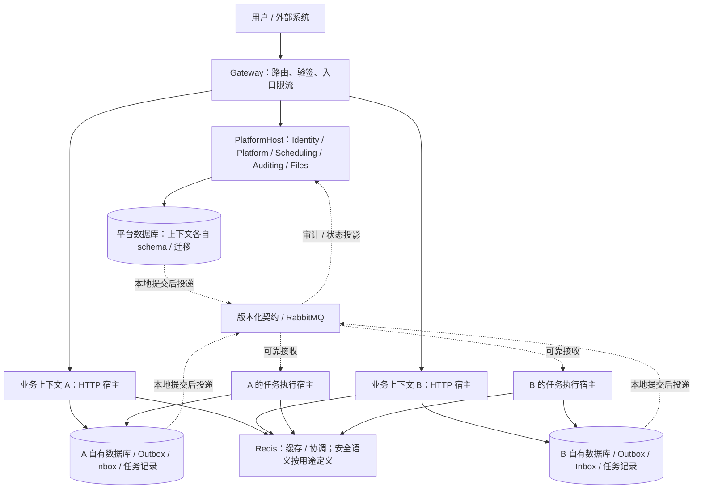

# NSN 架构接管审查与高可用验收基线

日期：2026-10-01。源码基线：`bb527e5`，从 `dev` 建立审查分支。

本文件记录代码审查证据、候选设计方向和验收建议，不是已批准的实现规格、生产认证或新的票据后端。实现规格和工作票据仍按仓库约定进入 GitHub Issues；既有 ADR 未被本文替换。

## 1. 目标与已知约束

- NS：`D:/LeoProject/NexusStack/NexusStackBackend`，旧模板。
- NSN：本仓库，目标为面向 DDD、可独立演进的业务微服务基础架构。
- 生产参考：`D:/CWChina/CWChinaERP/CWChinaPoS`。保本价重算、SMT 补货通知、MasterPricing 生成的实际使用体验，是异步任务设计的最低基线。
- 用户明确：目前只有单机，生产部署方案尚未确定。因此当前可以验证持久化、进程恢复、同机多副本协议和业务幂等，不能把这些结果称为跨主机高可用。
- 保留 ADR-0013：五个平台上下文共同部署，数据库内按 schema 隔离；未来业务上下文独立部署、独立拥有数据。单机可以运行多个业务服务，但它们共享主机故障域。
- SLO、RTO、RPO、流量与任务规模、部署预算、跨地域容灾要求尚未确定，不填写虚构指标，不预选 Kubernetes 或云产品。

接管以实现、故障行为和验证结果为依据。已有设计的作者或模型名称，不构成保留或推翻某项决定的证据。

## 2. 当前结论

NSN 已有值得保留的领域分层、显式宿主装配、架构约束、稳定事件命名、消息基础设施和测试装置。但默认宿主目前仍是以内存适配器运行的平台骨架，尚未证明生产持久性、完整跨上下文消息处理或多副本运行。

“代码存在”“宿主已装配”“故障场景已通过”“生产满足目标”是四种证据，不能互相替代。下面按源码可确认的事实与推导出的风险分别记录。

## 3. 需要保留的设计

| 来源 | 保留内容 | 适用边界 |
| --- | --- | --- |
| NS / PoS ERP | 业务提交任务方便，统一查看状态、结果与人工重试 | 内部可靠性增强不增加普通业务调用方的负担 |
| PoS ERP | 批次幂等、主子任务关联、按月分段、失败项隔离、执行代次 | 成本计算和批次成功条件继续属于业务上下文 |
| PoS ERP | Redis 可续期协调、重任务并发控制、提交结果核对 | 租约本身不能替代数据库写入时的执行权校验 |
| NSN | 上下文拥有数据，跨上下文只走 Contracts，领域不依赖基础设施 | 必须进一步验证运行期数据访问与真实通信，引用检查只覆盖结构 |
| NSN | 平台模块共同部署，未来业务分别部署 | 建模边界与部署边界分别论证，避免为增加进程数量而拆分 |
| NSN | 稳定事件名、默认拒绝、聚合版本语义、显式装配 | 保留现有约束，补齐实际宿主上的行为验证 |

共享代码仍遵循“第二个上下文证明需要才进入 BuildingBlocks”。两个 Handler 能证明同一上下文内部值得提取公共模块，但不自动证明应上移到全局共享内核；第二个副本也不等于第二个上下文。

## 4. 生产阻断项与关键风险

这里的“生产阻断”表示满足用户目标前必须解决，不表示这些代码已经在生产造成事故。本轮没有做生产故障注入。

### 4.1 默认宿主的重要状态不能跨重启保存

**源码事实：**

- `IdentityModule.cs:39` 注册 `AddIdentityInMemoryStorage()`。Identity 已有 EF 适配器与迁移，但默认模块没有选用它。
- `PlatformModule.cs:24`、`SchedulingModule.cs:26`、`AuditingModule.cs:30` 同样注册内存存储。
- `LocalDiskFileStore.cs:185` 为文件元数据注册内存仓储。磁盘文件内容保留，不代表文件登记信息可恢复。
- `InfrastructureServiceCollectionExtensions.cs:59` 默认注册内存 Outbox；源码中没有宿主对 `EfOutboxStore<TContext>` 的装配。

**风险：** 重启可能丢失用户、任务定义、配置、审计和文件索引；多副本各自维护不同状态。仅提供数据库连接配置不会改变当前装配。

**建议：** 显式区分演示/测试与持久运行配置；持久运行缺少必要存储时明确失败，不静默回退到内存。每个上下文拥有自己的 DbContext、schema、迁移和事务。选择适配器后仍需核对工作单元、消息存储、权限读取的生命周期，不能只替换一行注册。

**验收：** 经真实宿主创建数据和文件，停止并重启后按原标识可读取；同机两个副本交叉读写一致。验证目标必须是宿主实际选中的适配器。

### 4.2 Inbox 去重与业务提交尚未在消费模块中形成原子操作

**源码事实：** `RabbitMqConsumer.cs:210` 先调用 `TryBeginProcessingAsync`，之后执行 Handler；已有记录时直接 ACK。`EfInboxStore<TContext>` 使用即时 SQL 插入，消费者没有为它与 Handler 建立共同事务。`IInboxStore` 也没有已完成状态或可恢复执行租约。

**风险推导：** 若将当前消费流程直接接上持久 Inbox，插入去重记录后、业务落库前进程死亡，下一次投递会被判断为重复并 ACK。普通异常后的 `ReleaseAsync` 不能处理进程死亡；取消分支也不会执行释放。当前还没有正式上下文消费者接入，不能把它描述成已发生的数据丢失事故。

**现有测试的范围：** `OutboxAndInboxTests.SameMessageConsumedTwice_TakesEffectOnce` 在测试中手动包了工作单元事务；RabbitMQ 消费者测试使用 `InMemoryInboxStore`。两组分别通过，并不证明“真实消费者 + 持久 Inbox + 业务写入”的组合正确。

**建议：** 短处理由所属上下文的消费模块在一个本地事务中完成 Inbox、业务写入和后续 Outbox，提交后 ACK。长任务先事务性接收为持久任务，再由执行状态推进，不把几小时计算放进一个数据库事务。

**验收：** 分别在 Inbox 写入前后、业务提交前后、ACK 前后杀掉消费者；重启后业务效果正确，未完成工作可继续，已完成效果不重复。外部接口副作用另验幂等或结果核对。

### 4.3 重试/死信转移没有获得目标发布确认就 ACK 原消息

**源码事实：** `RabbitMqConsumer.cs:147` 创建普通 Channel；`MoveToAsync` 在 `BasicPublishAsync` 后立即 `BasicAckAsync`（307、316 行）。实际安装的 RabbitMQ.Client 7.2.2 文档说明，Channel 的发布确认和确认跟踪默认均为 false。此处也未处理 `BasicReturn`。

**风险推导：** 重试或死信目标队列缺失时，`mandatory: true` 并不会在这个流程中自动保证应用拒绝 ACK；发生断连等不确定结果时，也没有“目标已可靠接收”这一前提。正常路径测试不能覆盖该窗口。对照之下，`RabbitMqEventBus` 的正常发布路径已经显式启用两种确认选项，值得保留。

**建议：** 可靠转移需要处理 confirm、不可路由返回和结果未知，再决定原消息确认。允许重复转移并依靠幂等收敛；不能以避免重复为理由提前确认原消息。延迟队列的 DLX 转移保证也应按实际队列类型与版本单独验证。

**验收：** 删除重试目标、阻断确认、在转移前后断开连接，原消息或可恢复副本始终有明确归属，不出现静默消失。参考 [RabbitMQ 确认机制](https://www.rabbitmq.com/docs/confirms)。

### 4.4 会话撤销和授权尚不能形成全系统保证

**源码事实：** `IdentityUseCases.cs:552` 注册内存会话版本；`ISessionVersionStore.cs` 在没有记录时返回 0；`UserPermissionCache` 的版本与缓存都只在本进程。会话版本核对位于 Identity 的 `NexusStackAuthorizationFilter`，Platform、Scheduling、Files 主要使用普通 `RequireAuthorization()`；网关验签不读取会话版本。

**风险推导：** A 副本撤销不会改变 B 的内存版本；丢失版本记录可使某些旧令牌再次匹配默认版本。即使只运行一个副本，Identity 中的登出也未自动覆盖其他模块的受保护端点。平台配置写入、文件归属等权限还需要按业务动作明确，只有有效 JWT 不足以证明可以执行该动作。

**建议：** Identity 拥有持久撤销依据，通过明确契约供各执行入口核验；缓存失效窗口与依赖不可用时的行为必须明确。其他上下文仍自己决定资源权限，不读取 Identity 表。不能只增加 Redis 缓存就宣称跨实例立即撤销。

**验收：** A 登录/B 访问、A 撤销/B 拒绝，覆盖全部受保护模块；重启和清空缓存后旧凭据不会复活；普通 User 不能执行未授权的设置、任务或文件操作。

**ADR 关系：** 保留 ADR-0014 的 Identity 签发责任。未来独立业务服务加入后，应重新评估共享 HS256 密钥的信任范围、非对称验签和轮换机制；若引入 JWKS 或改变签发方式，显式修订对应 ADR，不借本审查悄悄替换。

### 4.5 默认 ID 配置不支持直接复制宿主

**源码事实：** `PlatformHost/Program.cs:40` 硬编码 `WorkerId = 101`。Snowflake 的时间和序列只在当前生成器实例内协调。

**风险推导：** 两个宿主在同一毫秒、同一序列位置生成相同 ID 是可能的。当前域层注入 ID 的规则正确，但不能证明部署实例之间唯一。

**建议：** 在保留 long ID 的前提下先设计部署分配、重复配置探测和重启/时钟回拨约束；如评估其他 ID 方案，要明确兼容代价，不能仅随机分配 WorkerId 就视为解决。

**验收：** 两副本配置冲突必须被识别或拒绝；同机并发、重启及回拨场景下没有重复写入。实际生产要进一步验证分配机制的故障行为。

### 4.6 消息与任务模块还没有真正的跨上下文业务闭环

**源码事实：** `NoIntegrationEventsMapper` 是默认映射器；没有 `*.Contracts` 工程或正式 `IIntegrationEventProcessor` 实现。`ScheduleRunner` 只推进 `ScheduledTask` 时刻并保存，没有把业务任务交给执行方。该现状也被 `CONTEXT-MAP.md` 明确标记为“还没建”。

**风险：** 现有通用模块测试只能证明各自机制；不能证明某个业务提交最终到达另一个上下文并完成。调度中的 Triggered 也不能当作业务执行成功。

**建议：** 先建立一条 Identity → Auditing 的持久消息旅程，验证 Contracts、映射、Outbox、消费事务和宿主装配；随后用经过领域分析的两个真实业务上下文验证独立部署。异步任务先以保本价与 SMT 场景推导需求，但不直接把生产项目文件夹名指定为服务边界。

### 4.7 就绪、路由与文件存储尚未支持多副本故障隔离

**源码事实：** 平台就绪目前只有文件存储依赖检查；网关探测后端 `/health/live`，且任意 cluster 完全不可达都会使整台网关报告不健康。路由从本地文件载入和修改；探测器捕获启动时的路由对象。文件字节位于本机，元数据仍在内存。

**风险：** 后端进程存活不能证明其写路径可用；未来一个非关键业务服务故障可能经全局就绪传播，导致健康业务流量也被摘除。多网关的路由修改无法自然同步，本地文件也不能直接支持跨主机下载。

**建议：** 分开进程存活、实例接流量能力和业务依赖状态；按目标摘除失败实例，按关键旅程定义全局就绪。路由采用有版本的统一配置及可核验更新；文件采用持久元数据和可替换存储适配器。单机本地磁盘继续适用于开发，但生产存储的共享、备份与恢复另行验收。

### 4.8 CI 绿色尚未覆盖持久化与消息故障组合

**源码事实：** 当前 CI 没有提供 PostgreSQL/RabbitMQ 服务或对应测试环境变量；`PostgresFact`、`RabbitMqFact` 在配置缺失时跳过。CI 的 `dotnet test` 与本地会要求依赖配置的 `scripts/run-tests.ps1` 行为不同。

**风险：** 绿色流水线可能未执行关键集成层。现有架构测试检查程序集和源码规则，也不能证明数据库权限、部署网络、消息恢复或多副本一致性。

**建议：** CI 使用隔离、短生命周期的测试依赖；明确区分单元、结构、真实依赖集成、端到端与故障测试，并报告运行/跳过数量。生产准入套件不能以缺配置跳过后仍算通过。共享开发库继续遵守仓库串行与使用者确认规则。

## 5. 候选目标结构

下图表达责任分配，属于审查建议，不宣称仓库已经实现，也不决定生产机器数量。

- 业务数据库可以暂时运行在同一 PostgreSQL 实例，但分别拥有数据库、账号和迁移；共享 DBMS 不等于互读表，也不提供主机容灾。
- 同一上下文的 HTTP 宿主和任务执行宿主可以共享它自己的数据所有权。重计算独立进程部署，避免 OOM 或线程池耗尽同时拖垮交互请求；这不把同一领域拆成两个上下文。
- Scheduling 管“何时触发”；目标上下文管“如何执行”和自己的业务结果。平台任务管理通过契约汇总进度，重试命令发回所属上下文，不跨库直接改任务表。
- 跨上下文事务采用本地提交与消息推进。补偿是业务动作，必须明确适用条件，不能把“回滚所有远端步骤”当作数据库回滚。
- Contracts 保留事件版本兼容，不把领域实体或 EF 类型公开。模板必须有独立发布、旧新版本共存、独立迁移的实际演示。

## 6. 异步任务与 Redis 的设计底线

### 任务模块

普通业务调用方应只需表达任务类型、输入、业务幂等键和必要的关联信息；执行模块集中承担持久受理、执行认领、代次、心跳、恢复、进度、错误分类与观测。尚不在本备忘确定具体方法签名或表结构。

- 保留“一条任务可承载一个业务批次”，不把 200 个商品默认变成 200 条独立任务。
- 主子任务、月份进度和失败项恢复可表达；等待子任务不长占消费名额或数据库连接。
- 自动恢复基础设施暂时故障；业务失败沿用人工决定重试的语义。重试次数、执行代次、发布次数不能混成一个含义模糊的字段。
- 进度与结果有结构化标识；展示文字可调整，不充当程序协议。业务幂等键与索引避免依赖扫描 JSON 历史记录。
- 重任务按资源组限制并发；副本增多不自动突破全局限制。退避有抖动和预算，故障分类决定暂停、重投或隔离。
- 进程退出、租约丢失、提交结果未知时，状态必须可核对和恢复；最终写入需验证执行代次或资源版本。
- 队列积压、最老待投递时间、任务停滞、失败原因、重试和隔离状态可观测；日志贯通业务关联标识、TaskId、Attempt 和 MessageId。

### Redis 模块

- 保留便捷的缓存与数据结构操作，同时明确命名空间、序列化版本、TTL 与错误语义。
- 普通缓存、权限/撤销缓存、执行协调分别定义故障策略。普通缓存可以回源，但应限制回源并发；安全状态缺失不能静默当作允许。
- 获取等待时间、租约有效期、续期节奏和业务超时分别表达；立即尝试的接口不能内部等待数小时。
- 用唯一持有者值校验释放与续期；租约丢失触发协作取消。数据库或目标资源必须在写入时拒绝过期执行者，不能只依靠“提交前再查一次锁”。
- Redis 切主与异步复制下的安全限制必须纳入设计；执行代次的产生不能在故障后回退。不同任务争用同一业务资源时，校验范围要覆盖那个资源。

这些约束的一手依据见 [微服务与高可用资料备忘](2026-10-01-microservices-availability.md)。

## 7. 后续推进顺序与完成证据

本节是审查后的依赖顺序建议，不是另建本地票据状态表。

| 顺序 | 范围 | 可以验收的结果 |
| --- | --- | --- |
| 1 | 持久运行装配、撤销语义、ID 唯一性 | 重启数据仍在；两个实例身份状态一致；扩副本不产生 ID 冲突 |
| 2 | 一条真实持久消息旅程，修正消费事务与转移确认 | 数据库与 Broker 不同失败窗口均恢复；重复消息不重复产生业务效果 |
| 3 | NS / PoS ERP 两条参考任务旅程与 Redis 协调 | 保本价、SMT 场景的进度、失败项、人工重试体验保留；进程中断后可续办；旧执行者不能覆盖新结果 |
| 4 | 真实业务上下文的独立部署与契约演进 | 一方升级、停机或延迟时，另一方按明确策略继续；无跨库读取或共同发布要求 |
| 5 | 隔离 CI、用户旅程、观测与恢复演练 | 经网关的完整行为有证据；集成层不靠跳过变绿；备份确实可以还原 |
| 6 | 生产故障域、容量和可用性目标 | 拓扑与预算确定后，实测故障切换、恢复时间、数据损失及故障后容量，才评估高可用达标 |

推荐第一条跨上下文消息旅程使用已有 Identity 和 Auditing，减少新领域假设。后续业务边界应从 PoS ERP 的真实行为与不变量推导；保本价和补货案例是验收素材，不表示把整个公司项目迁入模板。

## 8. 本轮验证与限制

- `dotnet build NexusStackNext.slnx --no-restore --nologo --verbosity quiet`：退出码 0，0 警告、0 错误。
- `dotnet test tests/Architecture.Tests/Architecture.Tests.csproj --no-build --no-restore --nologo --verbosity minimal`：退出码 0，17 通过、0 失败、0 跳过。
- `pwsh -File scripts/check-format.ps1`：退出码 0，0 处违规。此项为代码格式基线，不等于全量集成测试通过。
- 两份新增文档均已校验非空、有效 UTF-8、LF 换行及本地链接目标存在。
- 未运行全量共享数据库测试、真实 Broker 集成测试、真实宿主旅程或故障注入；没有以缺依赖跳过冒充这些测试通过。
- 未读取或输出凭据值，未连接生产/共享数据库，未启动 NS 或 PoS ERP 的 MQ/计划任务进程。
- 本轮仅新增审查和资料备忘，没有修改运行时代码、ADR、领域词表或既有架构不变量，也没有提交、推送或发布。

未覆盖的业务公式、安全细节、数据库迁移和容量行为继续需要专项验证；本审查不声称发现了全部缺陷或完成了生产高可用建设。
